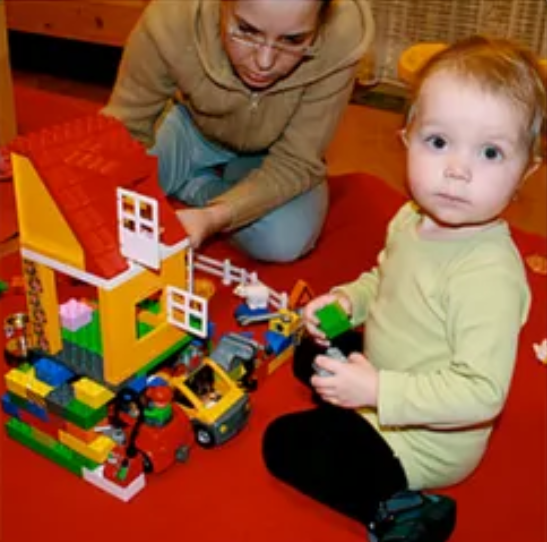
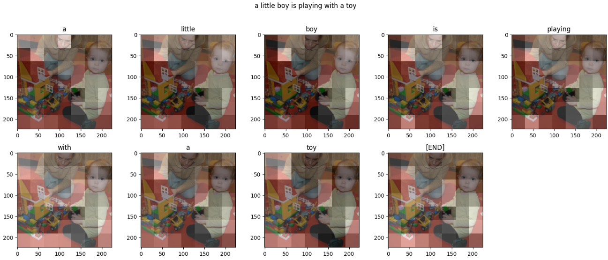

# Image Captioning with MobileNet Transformer

## Overview
This project aims to generate descriptive captions for images using a combination of the Flickr8k dataset, a MobileNet feature extractor, and a Transformer-based decoder. Image captioning is a challenging task in computer vision and natural language processing, requiring the model to understand both visual and textual information to generate accurate and meaningful captions.

## Dataset
The Flickr8k dataset is used for training and evaluation. It contains a large collection of images, each with five corresponding captions. The dataset is divided into training and test sets, with a separate set of images for evaluation.

## Model Architecture
### MobileNet Feature Extractor
The MobileNet model is used to extract high-level features from images. MobileNet is a lightweight convolutional neural network architecture designed for efficient image classification. By removing the classification head, we can use MobileNet as a feature extractor to obtain image embeddings.

### Transformer Decoder
The decoder architecture is based on the Transformer model, a powerful sequence-to-sequence architecture commonly used in natural language processing tasks. The decoder consists of multiple layers of self-attention and cross-attention mechanisms, allowing the model to focus on relevant parts of the image and previous words in the caption during generation.

### Attention Mechanisms
The model incorporates both causal self-attention and cross-attention mechanisms. Causal self-attention ensures that each word in the generated caption attends to previous words in a causal manner, preventing information leakage from future words. Cross-attention allows the model to attend to relevant parts of the image while generating each word in the caption.

## Training
The model is trained using a combination of image features and tokenized captions. Early stopping is employed to prevent overfitting and improve generalization performance.

## Usage
To use the trained model for image captioning, simply provide an image input, and the model will generate a descriptive caption for the image. The model can be deployed in various applications such as image search engines, assistive technologies for the visually impaired, and content creation tools.

## Dependencies
- TensorFlow 2.x
- TensorFlow Hub
- TensorFlow Text
- TensorFlow Datasets
- Matplotlib
- NumPy
- Pillow
- tqdm

## References
- [Flickr8k Dataset](https://www.kaggle.com/adityajn105/flickr8k)
- [MobileNet: Efficient Convolutional Neural Networks for Mobile Vision Applications](https://arxiv.org/abs/1704.04861)
- [Attention Is All You Need](https://arxiv.org/abs/1706.03762)
- [TensorFlow Documentation](https://www.tensorflow.org/)

### Sample Output

